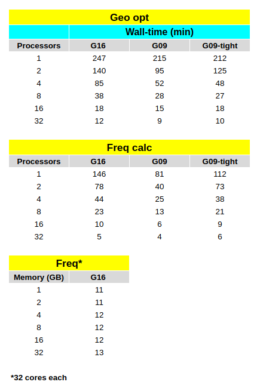
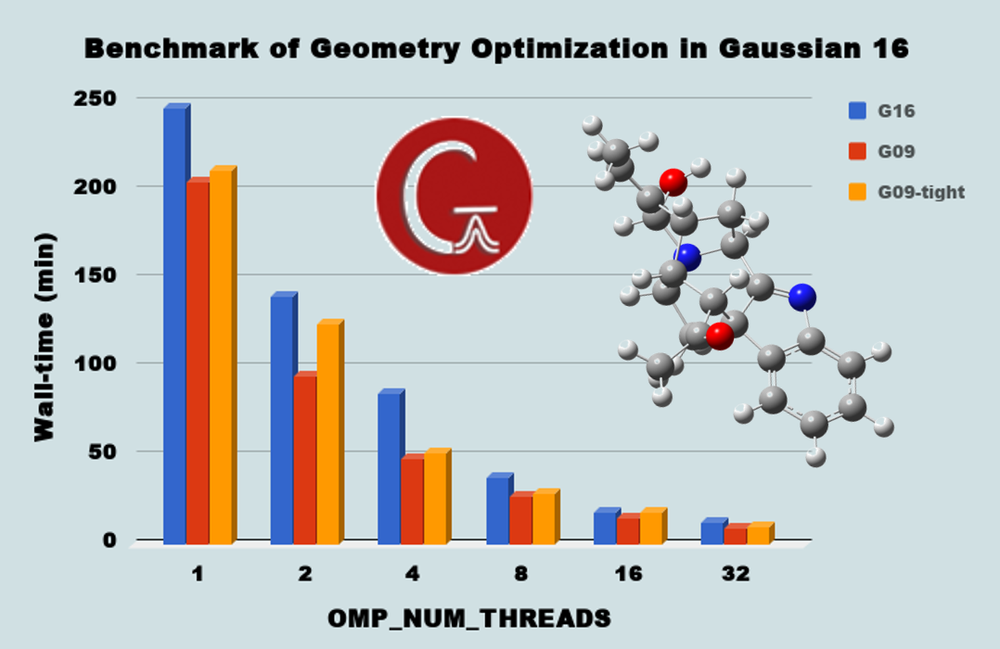
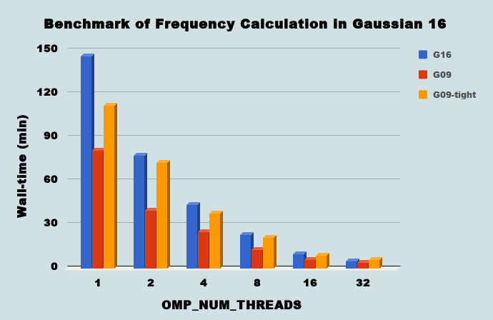
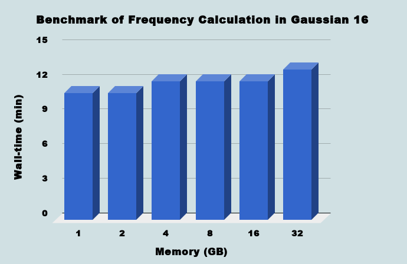

# Gaussian: Performance Test of G16 on Intel Xeon Gold 6148

- Date: 2018-06-09

In early 2018, Gaussian released G16 B.01 after releasing revision A.03 in 2017. I benchmarked this latest version of G16 for density functional theory (DFT) calculations and compared it with the previous version, G09 revision E.01. I was inspired by a post at http://computational-chemistry.com. I hope this benchmark is useful when choosing a Gaussian runtime.

To ensure a fair comparison, I adopted the Gaussian input file from the previous benchmark. I separately performed geometry optimization and frequency calculations of vomilenine using the DFT method.

### Computational details

- Linux OS: Red Hat Enterprise Linux Server release 7.3 (Maipo)
- CPUs model: Intel(R) Xeon(R) Gold 6148 CPU @ 2.40GHz (Total physical/logical cores = 20/40 cores)
- Memory: 8 GB (for all calculations)
- Software: G09 E.01 and G16 B.01
- Parallel method: Shared memory (OpenMP method)

### Input file

The input file can be obtained from https://pastebin.com/ja4s7e97.

All calculations used 8 GB of memory. For G16 and G09, I ran the calculations with default parameters. For G09-tight, I ran G09 with the keywords int=grid=ultrafine and scf=tight, which increased the number of grid points and improved integration accuracy from 10^-10 to 10^-12.

### Benchmark results

| Geometry Optimization | Frequency CPU Usage |
|-----------------------|---------------------|
|  |  |

| Frequency Memory Usage |
|-------------------------|
|  |

### Concluding remarks

- My benchmark results show that G16 runs slower than G09 because the default G16 settings use stricter SCF convergence criteria and a denser integration grid than G09.
- To make G09 follow settings closer to G16 defaults, `int=grid=ultrafine` and `scf=tight` should be used. However, G09 with these additional keywords is still faster than G16.
- New features in G16 improve the performance of some methods. However, for commonly used methods and SCF algorithms, G09 still appears more efficient in this benchmark.
- G16 does not show a significant speed improvement for DFT in these tests, so G09 may still be a practical choice for similar calculations.
- However, many new features in G16 are state-of-the-art methods available to computational chemists today.
