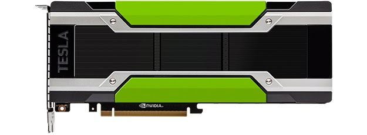
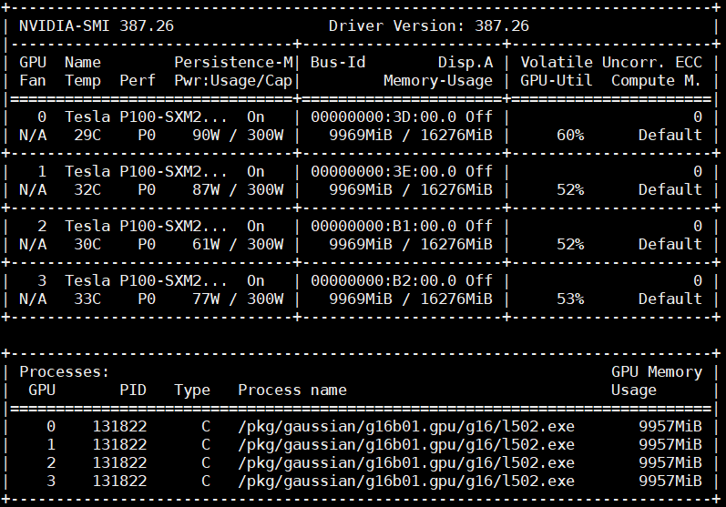
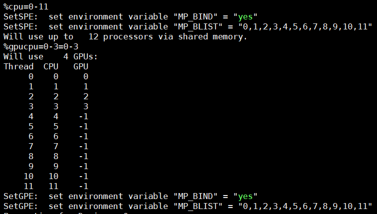
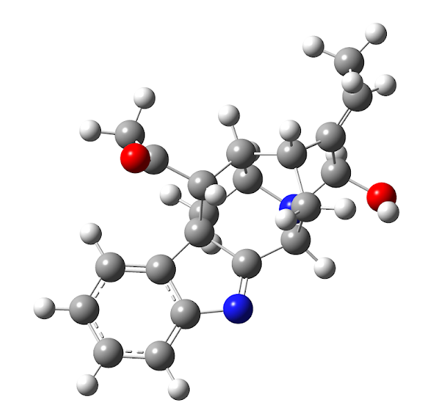
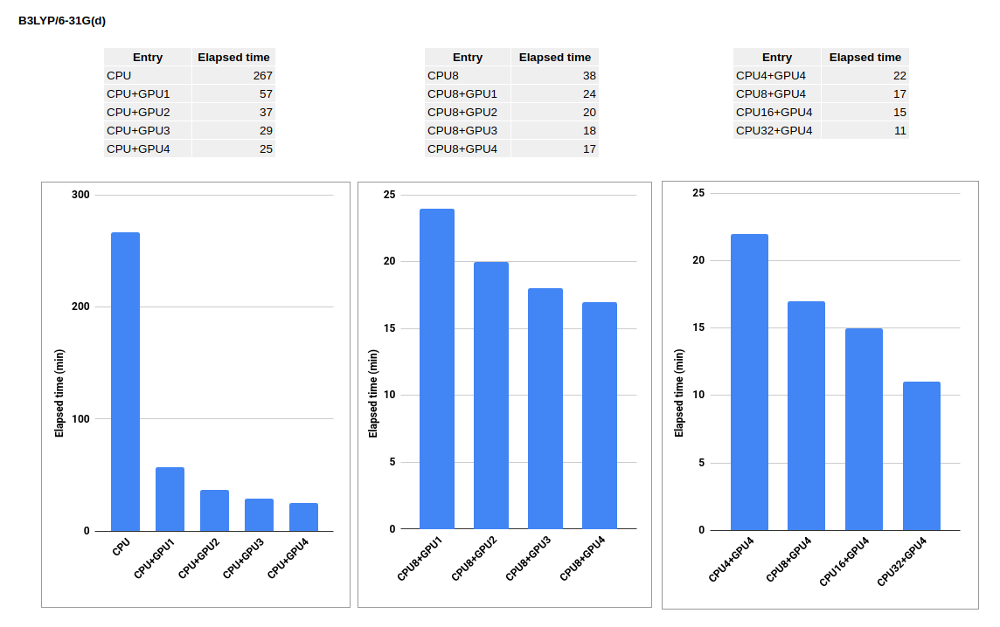
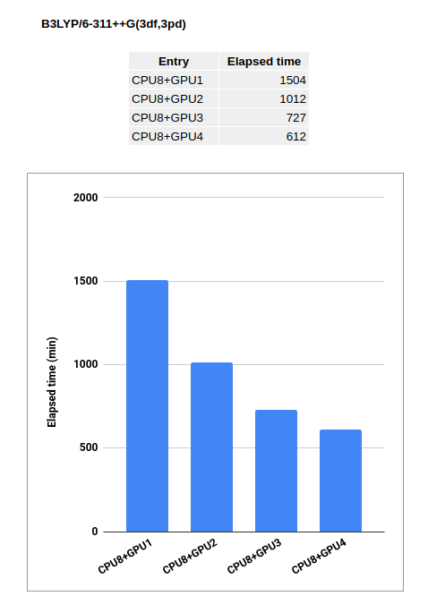

# Gaussian: Performance Test of G16 and Nvidia Tesla P100 GPU Acceleration

- Date: 2018-06-14

Gaussian 16 (G16) implements general-purpose graphics processing unit (GPGPU) support to speed up quantum chemistry calculations. In G16, GPGPU currently supports only Nvidia Tesla-series GPUs, including K20, K40, and P100 (at the time of writing, I used G16 revision B.01). GPGPU acceleration is available for Hartree-Fock (HF) and density functional theory (DFT), particularly gradient and frequency (Hessian) calculations. According to the G16 developers, GPGPU is not effective for n-th order Moller-Plesset (MPn), coupled-cluster (CC), or small calculations. Therefore, G16-GPGPU is most useful for large calculations.

This post presents a Performance Test of GPU speedup on the Nvidia Tesla P100 SXM 16 GB using G16 revision B.01 compiled with GPGPU, compared with the regular CPU-only G16 runtime. The test calculation is gas-phase geometry optimization of vomilenine using DFT.

### Compute Node Specification

| Tesla P100 |
|------------|
|  |

- CPU model: Intel Xeon Gold 6148 2.40GHz CPU
- System Memory: 192 GB
- Accelerator model: Nvidia Tesla P100-SXM2 16GB
- Number of cards: 4
- Number of accelerators per card: 1
- Linux OS: Red Hat Enterprise Linux 7.3 x86_64
- Intel Parallel Studio XE 2018
- Interconnect technology: Intel Omni-Path MPI

### Preparation of G16 input for exploiting GPGPU

G16 is user-friendly, even for beginners. It is also easy to prepare an input file for calculations that use both CPUs and GPUs. First, you need to know how many CPU cores and GPUs your machine has. Use the `lscpu` command to check available CPU ranks, and use `nvidia-smi` to check GPU utilization.

In my case, I had 40 CPU cores and 4 GPUs. Four CPU cores were used to control the 4 GPUs, leaving 36 active CPU cores for the calculation. This means the computation used 36 CPU cores and 4 GPUs. To set up a GPGPU input file based on this allocation, I replaced `%nprocshared=N` with the following lines:

```
%CPU=0-39
%GPU=0-3=36-39
```

I call this _CPU36+GPU4_, which means the calculation will:

1. Use 40 CPUs: numbers 0 to 39.
2. Use 4 GPUs: numbers 1, 2, 3, and 4.
3. Use 4 CPU cores to control the 4 GPUs: numbers 36, 37, 38, and 39.

Please see http://gaussian.com/gpu for more details.

My G16-GPU calculation is submitted using the command:

```
g16 < input > output 2>&1
```

`2>&1` is used to redirect stderr and stdout to the output file.

To make sure your G16 calculation is actually using GPGPU, use the `nvidia-smi` utility and check the beginning of the output file. Below is an example of the `nvidia-smi` interface and part of the output.

GPU utilization

Calculation using CPU8+GPU4 processors. 4 GPUs are used for GPGPU and 4 of 12 CPU cores are used to control those GPUs.

| GPU Utilization | Calculation GPU |
|-----------------|-----------------|
|  |  |

### Computational details

- Geometry optimization of vomilenine using B3LYP
- Basis set/basis functions: 6-31G(d)/419 and 6-311++G(3df,3pd)/1371

Here is input file https://pastebin.com/B6GfC1Kc.

| Vomilenine Structure |
|----------------------|
|  |

### Benchmark Results

| 6-31G(d) | 6-311++G(3df,3pd) |
|----------|-------------------|
|  |  |

### Concluding remarks

- I found that GPU acceleration, compared with CPU-only runs, significantly speeds up the calculation.
- For the calculation using a small basis set, increasing the number of GPUs does not significantly increase the parallel efficiency.
- The parallelism performance of G16-GPU for large calculations (the biggest basis set) is clearly apparent rather than that when computing small calculations.
- I apparently see the hidden ability of G16-GPU when running larger calculations (the biggest basis set).
