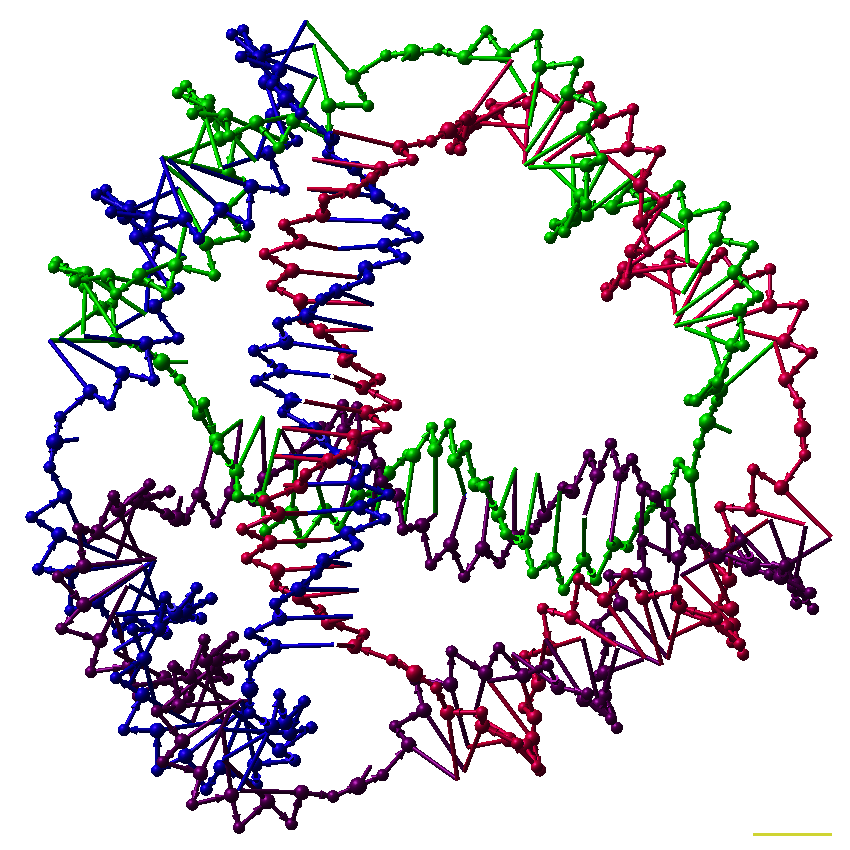
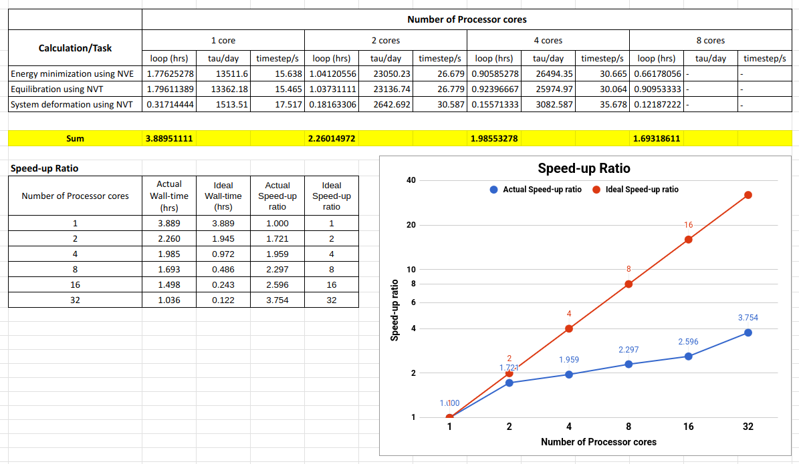
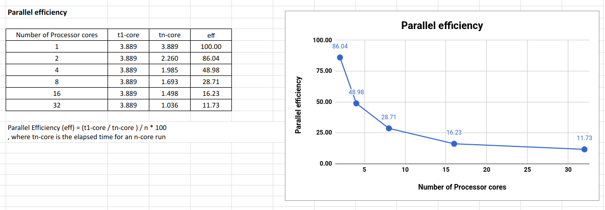

# LAMMPS: Performance Test of Dissipative Particle Dynamics (DPD) Simulation on CentOS

- Date: 2018-05-31

### Test system

- Studied system: A polymeric system including 100,000 particles.
- Method: Coarse-grained dissipative particle dynamics (DPD)

### Linux machine specification

- CentOS 7.5.1804
- Intel(R) Core(TM) i7-5820K CPU @ 3.30GHz, 6 physical cores (12 logical cores)
- Memory 32 GB

### LAMMPS compilation info

- Version 7 Apr 2016
- Compiled with Intel compiler and MPI
- Used LAMMPS standard package

### Calculation time and Benchmarks

