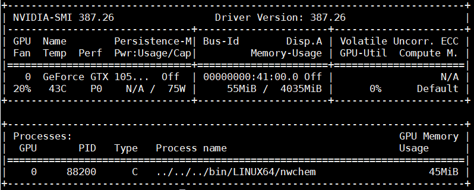

# NWChem: Performance Test for CCSD(T) and CCSD[T] Calculation on GeForce GTX 1050 Ti

- Date: 2019-01-10

This is a test of coupled-cluster geometry optimization for a water molecule using CCSD(T) and CCSD[T] with the cc-pVDZ basis set. In this test, the NVIDIA GTX 1050 Ti is used as an accelerator compared with CPU-only execution.


### Specification of Special Item

```text
Graphics Engine NVIDIA GeForce GTX 1050 TI
Bus Standard PCI Express 3.0
OpenGL OpenGL4.5
Video Memory
GDDR5 4GB Engine Clock
GPU Boost Clock : 1392 MHz
GPU Base Clock : 1290 MHz
CUDA Core : 768
Memory Clock 7008 MHz ( DDR2 )
Memory Interface 128-bit
```

### CPU info

I used a Ryzen Threadripper 1950X. For details and performance, please visit the related benchmark post.

### NWChem compilation details

Here is the script I used to compile NWChem with OpenMPI v. 2.0.2 and CUDA v. 9.1 on CentOS 7.

https://github.com/rangsimanketkaew/Auto-NWChem/blob/master/script/CentOS-OpenMPI-GPU.sh

You must make sure that the architecture specified in `CUDA_FLAGS` is correct and supported by `nvcc`.

Use the `nvcc --help` command and read its help page for more details. The following is part of the compile script I used. Here, I set the `-arch` argument to `sm_50`.

```text
export TCE_CUDA=Y
export CUDA_LIBS="-L/usr/local/cuda-9.1/lib64/ -L/usr/local/cuda-9.1/lib64/ -lcudart"
export CUDA_FLAGS="-arch sm_50 "
export CUDA_INCLUDE="-I. -I/usr/local/cuda-9.1/include/"
```

I am not an expert. When I get confused or have difficult questions, I consult the manual or ask the program developers.

- Manual of the tensor contraction engines (TCE) module: https://github.com/nwchemgit/nwchem/wiki/TCE (GPU information is at the bottom of the page).

### Is your calculation using GPU?

In Linux, it is easy to check GPU status. For Nvidia GPUs, run `nvidia-smi`; it shows basic information like the example below.



Status of GTX 1050 Ti while running an NWChem calculation.

**The output shows:**

- The version of Nvidia driver is 387.26.
- There is one GPU card on the machine.
- GPU fan is 20%.
- Temperature is 43 degrees Celsius.
- The process name shows the name of software!
- Memory usage of each current process.

### Input file and molecule details

```text
#@@  Sample NWChem input for Coupled Cluster (CC) calculation
#@@  using TCE module in NWChem 6.8 and enabling CUDA.
start tce_ccsd_t_h2o
echo
memory total 8 GB
geometry units bohr
O     0.00000000     0.00000000     0.22138519
H     0.00000000    -1.43013023    -0.88554075
H     0.00000000     1.43013023    -0.88554075
end

basis spherical
H library cc-pVDZ
O library cc-pVDZ
end

scf
  thresh 1.0e-10
  tol2e 1.0e-10
  singlet
  rhf
end

tce
  ccsd(t)
  io ga
  cuda 1
end

task tce energy
task tce optimize
```

### Confirm that CUDA is enabled and used

The following is part of the output file for a CCSD(T) calculation accelerated by CUDA. The key phrase that confirms CUDA is being used is `Using CUDA CCSD(T) code`, shown in the energy summary section after the iterations complete.

```text
...
 CCSD(T)
 Using CUDA CCSD(T) code
 Using   1 device per node
 CCSD[T]  correction energy / hartree =        -0.007842454657787
 CCSD[T] correlation energy / hartree =        -0.385821575619310
 CCSD[T] total energy / hartree       =      -145.328578427813056
 CCSD(T)  correction energy / hartree =        -0.007637197317536
 CCSD(T) correlation energy / hartree =        -0.385616318279060
 CCSD(T) total energy / hartree       =      -145.328373170472815
 Cpu & wall time / sec            0.3            1.8
...
```

### Test Results

I have not had time to fully update and finish this benchmark yet. Stay tuned for updates.
