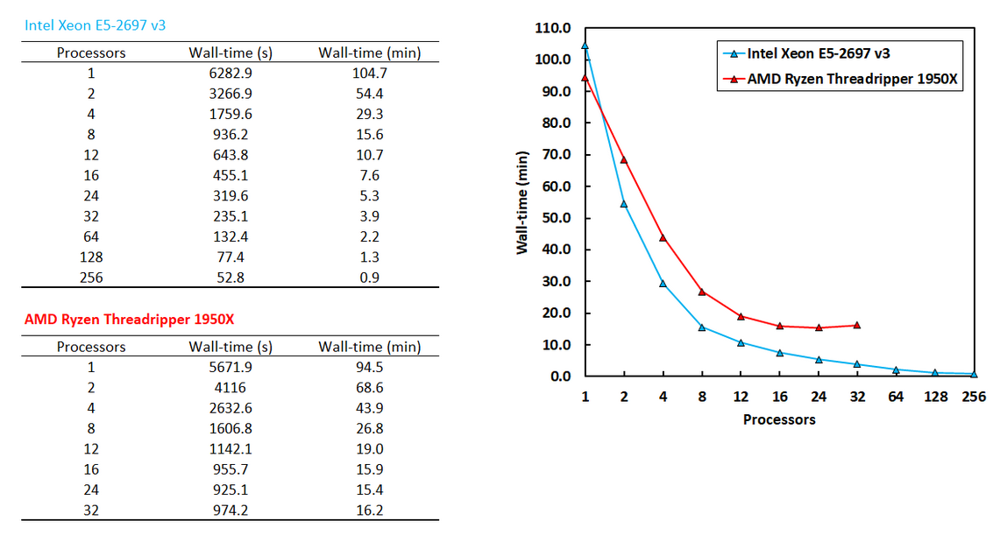

# NWChem: Performance Test of DFT Calculation running on Ryzen Threadripper

- Date: 2018-06-02

In this post, I present benchmark results for the Ryzen Threadripper 1950X CPU in quantum chemistry calculations using the NWChem package. Ryzen Threadripper was a state-of-the-art AMD CPU, and the 1950X was the top model in the Threadripper series. It has 16 cores and 32 threads, making it a strong candidate in AMD-Intel performance comparisons. I was excited to test AMD hardware for DFT calculations. The following sections describe the machine resources and CPU specifications used in this test. The comparison candidate is the Intel Xeon E5-2697 v3.

AMD Ryzen™ Threadripper 1950X

```
Architecture:          x86_64
CPU op-mode(s):        32-bit, 64-bit
Byte Order:            Little Endian
CPU(s):                32
On-line CPU(s) list:   0-31
Thread(s) per core:    2
Core(s) per socket:    16
Socket(s):             1
NUMA node(s):          2
Vendor ID:             AuthenticAMD
CPU family:            23
Model:                 1
Model name:            AMD Ryzen Threadripper 1950X 16-Core Processor
Stepping:              1
CPU MHz:               2200.000
CPU max MHz:           3400.0000
CPU min MHz:           2200.0000
BogoMIPS:              6786.58
Virtualization:        AMD-V
L1d cache:             32K
L1i cache:             64K
L2 cache:              512K
L3 cache:              8192K
NUMA node0 CPU(s):     0-7,16-23
NUMA node1 CPU(s):     8-15,24-31
```

Intel® Xeon® Processor E5-2697 v3

```
Architecture:          x86_64
CPU op-mode(s):        32-bit, 64-bit
Byte Order:            Little Endian
CPU(s):                28
On-line CPU(s) list:   0-27
Thread(s) per core:    1
Core(s) per socket:    14
Socket(s):             2
NUMA node(s):          4
Vendor ID:             GenuineIntel
CPU family:            6
Model:                 63
Stepping:              2
CPU MHz:               2593.971
BogoMIPS:              5187.58
Virtualization:        VT-x
L1d cache:             32K
L1i cache:             32K
L2 cache:              256K
L3 cache:              17920K
NUMA node0 CPU(s):     0,2,4,6,8,10,12
NUMA node1 CPU(s):     1,3,5,7,9,11,13
NUMA node2 CPU(s):     14,16,18,20,22,24,26
NUMA node3 CPU(s):     15,17,19,21,23,25,27
```

### Program compilation

NWChem 6.8.1 was used in this test and was compiled manually with OpenMPI.

https://github.com/rangsimanketkaew/Auto-NWChem/tree/master/script

### Tested molecule and calculation setup

- Molecule: Tryptophan
- Method: Density functional theory
- Task: Single-point energy calculation
- Functional: B3LYP and M06-2X
- Basis set: 6-311++G(d,p)
- Basis functions: 429
- Charge: 0
- Spin state: Singlet
- Integral approach: Direct (on-the-fly)

### Input file

```
echo
start tryp-b3lyp-6-311++Gdp
memory stack 600 mb heap 50 mb global 400 mb noverify
scratch_dir /scratch/rangsiman/nwchem
permanent_dir .

geometry units angstrom noautoz
  symmetry c1
C       0.2699104420    -1.0108865836    -0.3683130952
C      -1.1717252744    -0.8428104535    -0.6503439320
H      -1.6792014443    -1.8288725326    -0.6137671086
H      -1.2877723491    -0.4791725466    -1.6914105077
C      -1.8459588054     0.1499150058     0.3112067480
N      -1.7959317480    -0.2468329763     1.7377821167
H      -2.2161720921    -1.1448059777     1.8585129306
H      -0.8394916844    -0.2879496005     2.0220904138
C      -3.3065223884     0.3106051815    -0.0869777892
O      -4.1944847211    -0.5221564648    -0.1054323635
O      -3.6537704097     1.5539926964    -0.4899646874
H      -4.5802415103     1.5796675292    -0.7087540852
H      -1.3128990822     1.1406738377     0.2349841455
C       1.2474179299     0.0408346940    -0.2193620936
C       1.1555245659     1.4391072316    -0.2186973930
C       2.3081955252     2.1747669480    -0.0390077626
C       3.5576637434     1.5487271836     0.1399510886
C       3.6811726255     0.1743154306     0.1469359543
C       2.5117189698    -0.5776612422    -0.0342040773
N       2.3171955667    -1.9742551771    -0.1274834562
C       0.9334831586    -2.2180739422    -0.2646030476
H       0.5181836619    -3.2254029279    -0.3238168600
H       2.9606157503    -2.6398109623     0.2168686362
H       4.6508019433    -0.3124295201     0.2889135247
H       4.4464013075     2.1732956451     0.2793431837
H       2.2595898801     3.2691493913    -0.0301538306
H       0.1720969826     1.9155481639    -0.3412322606
end

basis cartesian
* library 6-311++G**
end

dft
  xc b3lyp
  direct
end

task dft energy ignore
```

### Benchmark Results

For a fair comparison, keep in mind that the Ryzen Threadripper 1950X has 16 physical cores (2 threads per core), while the Xeon 2697 v3 has 28 physical cores (1 thread per core).

Therefore, I recommend focusing on the results for 1-16 processors.



The table and figure above are preliminary results. I need to verify the results again to ensure that all published values are correct.

### To-do list

- Write discussion
- Re-run calculations to confirm results
- Check memory dependence
- Re-compile NWChem for the Ryzen system with MVAPICH2 v2.2b; the current version was compiled with OpenMPI
- Perform DFT calculation with M06-2X functional
