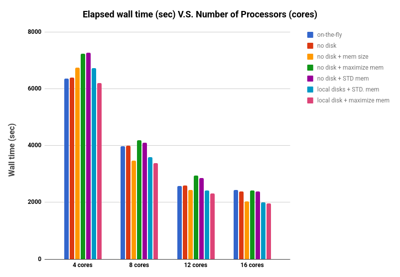
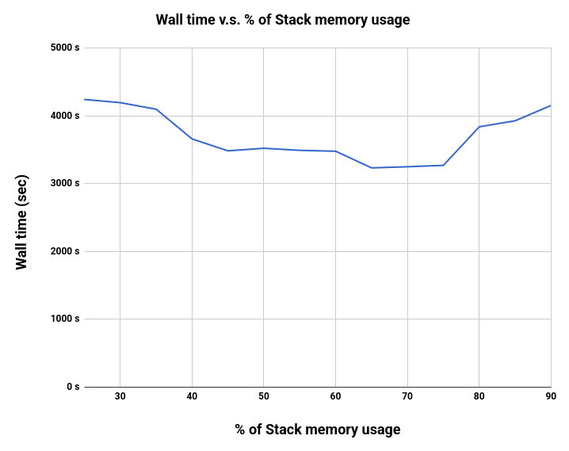

# NWChem: Performance Test of Integral Evaluation Approaches

- Date: 2018-04-01

### Short summary

> I found that ​increasing stack memory, with decreasing global memory (GPFS) can be useful for single-point energy and optimization calculations in NWChem to be more faster. Also writing integral scratch on temporally memory can help.


### Integral Evaluation Approaches

I systematically studied the relationship between the speed of singlet-energy calculations for a Ru(II)-Re(I) complex and different integral approaches. In NWChem DFT calculations, inverted charge-density and exchange-correlation matrices are computed and written to disk. Adjusting the integral approach can be beneficial for accelerating geometry optimization in constrained density functional theory (CDFT) with NWChem.

The following keywords in NWChem control integral scratch files in different ways:

1. `INCORE`: All integrals are evaluated once and stored in memory. The matrix is then built from them.
2. `DIRECT`: Any time you need an integral it is evaluated, but never stored. “On-the-fly”.
3. `SEMI­DIRECT`: Some of the integrals are stored in memory or on disk, the others are evaluated when needed.
4. `NOIO`: Prevents file storage on disk and memory (No Input/Output). This is generally not useful.

### Computational setup

- Task: Performing single-point energy calculation using Constrained-DFT on Ru(II)-Re(I) bridged complex.
- Program: NWChem version 6.6 (https://nwchemgit.github.io)
- MPI architecture: MVAPICH 2.2 (shared memory)
- Compiler: Intel compiler 2013
- Method: CDFT with B3LYP
- Basis set: 6-31G(d) for light atoms // SDD-ECP for Ru and Re atoms
- Basis functions: 1010 (spherical); 1077 (Cartesian)
- Ex. Input file: https://docs.google.com/document/d/1DfwFtrPi5AViZgJgmylw5nNxRwt0xhDBdGbzKxxPLx4/edit?usp=sharing
- Ex. Output file: https://docs.google.com/document/d/1I5wHTUWNfx2Fo4FRpaZQ3m5YIp7ZNuwOCPLdyZTtB4o/edit?usp=sharing

### Specification of computing Linux machine

```
Component                  Specification                                                No.
------------------------------------------------------------------------------------------------
CPU:                      Intel® Xeon® processor E5 v3 2.6 GHz (14 cores/ 14 HTs)       x2
Memory:                   128 GB (Total) DDR4-2133 MHz
Disk Drive:               PERC H730P
Network Interface Intel®  Ethernet Controller X710                                      x4
```

### Benchmarking Evaluation of Integral Storage Options

Integral storage choices used in this evaluation are:

1. On-the-fly: Compute integrals when needed with standard memory
   ```
   direct (same as semidirect filesize 0 memsize 0)
   ```
   Standard memory: 50% global, 25% stack, and 25% heap

2. no disk: Do not store scratch files; use standard memory
   ```
   semidirect filesize 0
   ```

3. no disk + mem size: Do not store files and use 100 MW in memory
   ```
   semidirect filesize 0 memsize 100000000
   ```

4. no disk + maximize mem: Do not store files and use a high stack-memory percentage
   ```
   semidirect filesize 0
   ```
   specifying memory: 20% global, 75% stack, and 5% heap

5. no disk + STD mem: Do not store files and use standard memory
   standard memory: 50% global, 25% stack, and 25% heap
   ```
   semidirect filesize 0
   ```

6. local disks + STD. mem: Use local disk on the cluster with 100 MW memory and standard memory settings
   ```
   semidirect filesize 100000000
   ```

7. local disk + maximize mem: Use local disk, 100 MW memory, and high stack memory
   ```
   semidirect filesize 100000000
   ```
   specifying memory: 20% global, 75% stack, and 5% heap

What we found (disclaimer: these tests may contain errors; you should benchmark NWChem yourself as well):





### Conclusions

For DFT single-point energy calculations (and geometry optimization), NWChem should be run in "semi-direct" mode with a high percentage of stack memory. This means recalculating integrals on demand instead of saving them to disk. This is especially important when running on a large cluster with a shared filesystem. In our evaluations, increasing stack memory up to 65% was about 1-1.5 times faster than standard memory settings.

### Suggestion

The following memory settings are suggested for higher CDFT optimization efficiency. The memory used in all tests was 2 GB per process.

```
memory total 2000 stack 1300 heap 100 global 600 mb
dft
    semidirect filesize 0 memsize 100000000
    grid nodisk
end
```

### References

1. NWChem manual: http://www.nwchem-sw.org/index.php/Release66:NWChem_Documentation
