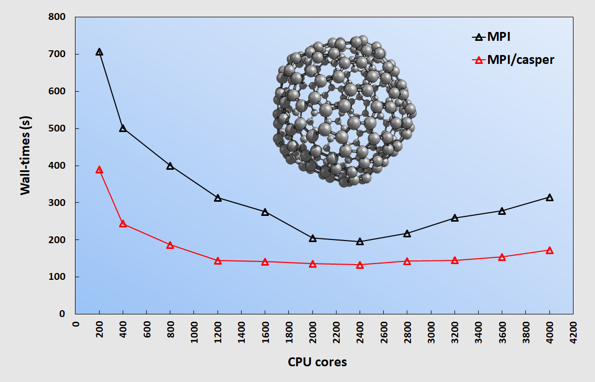
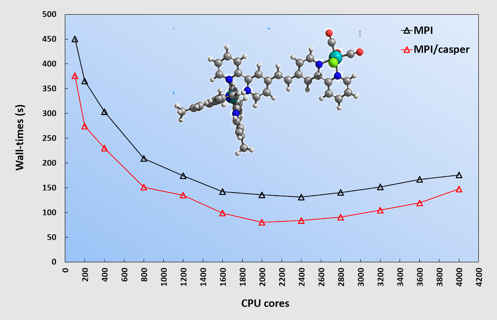

# NWChem: Performance Test of MPI Parallelization Efficiency for DFT calculation

- Date: 2018-06-10

Message Passing Interface (MPI) is a standardized and portable message-passing protocol for a wide range of parallel computing architectures. MPI supports several compilers, including Intel Composer Suite, GCC, and PGI. In practice, MPI is a communication protocol for programming parallel computers. NWChem code architecture is also designed around MPI. The figure on the right shows a compute-node cluster connected by network cables, where nodes can communicate with each other.

- Distributed Memory Model
- Message Passing Style
- More flexible
- Better scalability

In this benchmark, NWChem 6.8.1 was run in parallel using MPI on an HPC cluster with Intel Xeon Gold 6148 CPUs (20 cores, 40 threads, 2.4 GHz). Compute nodes are connected using an Intel Omni-Path (100 Gbps) network. NWChem was compiled with Intel MPI + MKL 2018. The number of processor cores ranged from hundreds to thousands: 200-4000 cores.

Another candidate is MPI/CASPER, which improves standard MPI communication performance between processors using the CASPER algorithm. More details about CASPER are available on [its official website](https://pmodels.github.io/casper-www/). Therefore, the computational cost of standard MPI was compared with MPI/CASPER. The following sections summarize the computational setup and benchmark results.

**Single-point energy calculation of a C240 molecule.**

- PBE0/6-31G(d)
- Basis functions: 3600
- The use of 2400 CPU cores was the fastest calculation.

**Single point energy calculation of Ru(II)-C2H2-Re(I) complex**

- B3LYP/6-31G(d)
- Basis functions: 676
- The use of 2000 CPU cores was the fastest calculation.

### Concluding remarks

- MPI and MPI/CASPER show good parallelization efficiency for both calculations when using 200-2000 CPU cores, but efficiency drops when the number of CPU cores exceeds 2600.
- NWChem can be efficiently exploited with MPI, especially in the range of 1800-2400 CPU cores.
- Both calculations clearly show that MPI with help from CASPER outperforms standard MPI.
- CASPER can significantly improve MPI process communication for the DFT module in NWChem.
